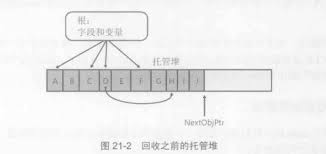
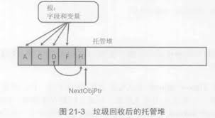

## 托管堆和垃圾回收

> 在面向对象的环境中，每个类型都代表可供程序使用的以一种资源。要使用这些资源，必须为代表资源的类型分配内存。

#### 托管堆基础

###### 访问一个资源所需的步骤

* 调用 IL 指令 `newobj`，为代表资源的类型分配内存 _(C# new)_。
* 初始化内存，设置资源的初始状态并使资源可用。类型的实例构造器负责设置初始状态。
* 访问类型的成员来使用资源(有必要可以重复)。
* 摧毁资源的状态以进行清理。
* 释放内存(垃圾回收器独自负责)。

###### 从托管堆分配资源

> CLR 要求所有对象都从**托管堆**分配。进程初始化时，CLR 划出一个地址空间区域作为托管堆。
>
> CLR 还要维护一个指针 _(NextObjPtr)_，该指针指向下一个对象在堆中的分配位置。刚开始的时候，_NextObjPtr_ 设为地址空间区域的基地址。
>
> 一个区域被非垃圾对象填满后，CLR 会分配更多的区域。这个过程一直重复，直至整个进程地址空间都被填满。

* `new` 操作符导致 CLR 执行以下步骤：
  * 计算类型的字段（以及从基类型继承的字段）所需的字节数。
  * 加上对象的开销所需的字节数。`类型对象指针` 和 `同步块索引`。32 位程序每字段各需 32 位(共 8 字节)，64 位 double。
  * CLR 检查区域中是否有分配对象所需的字节数。
    * 如果有足够空间，就在 `NextObjPtr` 指针指向的地址处放入对象，为对象分配的字节会被清零。
    * 调用类型的构造器（为 `this` 参数传递 `NextObjPtr`），`new` 操作符返回对象引用。
    * 在返回这个引用之前，`NextObjPtr` 指针的值会加上对象占用的字节数来得到一个新值，即下个对象放入托管堆时的地址。

###### 垃圾回收算法

> 应用程序调用 new 操作符创建对象时，可能没有足够地址空间来分配该对象。发现空间不够，CLR 就执行垃圾回收。
>
> 事实上，垃圾回收是在第 **0** 代满的时候发生。

> 如果 CLR 在一次 GC 之后回收不了内存，而且进程中没有空间来分配新的 GC 区域，说明内存已经耗尽，`new` 操作符就会抛出 `OutOfMemoryException`。

> 静态字段引用的对象一直存在，知道用于加载类型的 `AppDomain` 卸载为止。
>
> 内存泄漏的一个常见原因就是让静态字段引用某个集合对象，然后不停的向集合添加数据项。静态字段使集合对象一直存活，而集合对象使所有数据项一直存活。

* **引用跟踪算法**
  * **引用计数算法** 存在问题，所以 CLR 使用一种 **引用跟踪算法**。该算法只关心引用类型的变量，因为只有这种变量才能引用堆上的对象。
  * 我们将所有引用类型的变量都成为 **根**。
* GC 流程
  * 开始 GC 时，首先暂停进程中的所有线程。
    * 防止线程在 CLR 检查期间访问对象并改变其状态。
  * 然后 CLR 进入 GC 的**标记**阶段。
    * CLR 遍历堆中的所有对象，将同步块索引字段中的一位设为 0.这表明所有对象都应删除。
  * CLR检查所有活动根，查看它们引用了哪些对象。
    * 如果一个根包含 null，CLR 忽略这个根并继续检查下一个根。
* **标记 阶段** 
  * 任何根如果引用了堆上的对象，CLR 都会标记那个对象（将其同步块索引中的位设为 1）。一个对象被标记后，CLR 会检查那个对象中的根，标记它们引用的对象。如果发现对象已经标记，就不重新检查对象的字段。避免了产生死循环。
  * 检查完毕后，所有的对象要么已标记，要么未标记。已标记的对象不能被垃圾回收，我们称这种对象是**可达 _(reachable)_** 的。未标记的对象是**不可达 _(unreachable)_**的。
* **压缩 _(compact)_ 阶段**
  * 压缩所有幸存下来的对象，使它们占用连续的内存空间。好处是：
    * 恢复了引用的 _局部化_。减小了应用程序工作集合，提升了访问这些对象时的性能。
    * 可用空间也全部是连续的。
    * 压缩意味着托管堆解决了本机（原生）堆的空间碎片化问题。
  * CLR 要从每个根减去所引用的对象在内存中便宜的字节数。保证它引用的还是以前的对象。
  * 压缩好内存后，_NextObjPtr_ 指针指向最后一个幸存对象之后的位置。
  * 压缩完成后，CLR 恢复应用程序的所有线程。





###### 垃圾回收和调试

> 一旦根离开作用域，它引用的对象就会变得**不可达**，GC 会回收其内存。

> 使用 C#编译器的 `debug` 开关编译程序集时，编译器会应用 `System.Diagnostics.DebuggableAttribute`，并为结果程序集设置 `DebuggingModes` 的 `DisableOptimizations` 标志。运行时编译方法时，JIT 编译器看到这个标志，会将所有根的生命期延长至方法结束。


#### 代：提升性能

* CLR 的 GC 是基于**代**的垃圾回收器 _(generational garbage collector)_，它对你的代码做出了以下几点假设：
  * 对象越新，生存期越短。
  * 对象越老，生存期越长。
  * 回收堆的一部分，速度快于回收整个堆。

###### **代**的工作原理

* 如果没有回收到足够的内存，垃圾回收器会执行一次完整回收。如果还是不够，就抛出 `OutOfMemoryException` 异常。
* 这些**代**被垃圾回收时，垃圾回收器会检查有多少内存被回收，以及有多少对象幸存。基于这个结果，垃圾回收器可能增大或减小这些代的预算，以提升性能。
* 可以使用 `GCNotification` 类在第 0 代或第 2 代回收时引发一些事件。可以利用该事件在发生一次回收时响铃，计算两次回收的间隔时间，计算两次挥手之间分配了多少内存等。

###### 垃圾回收触发条件

* 最常见的是，CLR 在检测到第 0 代超过预算时触发一次 GC。
* 代码显式调用 `System.GC` 的 `Collect()` 方法（Microsoft 强烈反对）。
* Windows 报告低内存情况。
* CLR 正在卸载 AppDomain。执行涵盖所有代的垃圾回收
* CLR 正在关闭。

###### 大对象

> CLR 将对象分为大对象和小对象，目前认为 **85000** 字节以上的对象是大对象。

* CLR 以不同方式对待大小对象
  * 大对象不是在小对象的地址空间分配，而是在进程地址空间的其他地方分配。
  * 目前版本的 GC 不压缩大对象，因为在内存中移动他们代价过高。这可能在进程中的大对象之间造成地址空间碎片化，以至于抛出 OutOfMemoryException。CLR 可能在未来的版本中压缩大对象。
  * 大对象总是第 **2** 代。所以只能为需要长时间存活的资源创建大对象。否则会造成第 2 代被频繁的回收，损害性能。
  * 大对象一般是大字符串_(XML、JSON)_或者用于 I/O 操作的字节数组_(从文件或网络将字节读入缓存区以便处理等)_。

###### 垃圾回收模式

> CLR 启动时会选择一个 GC 模式，在进程终止前该模式不会改变。

* 有两个基本 GC 模式：
  * 工作站_(默认)_
    * 该模式针对**客户端**程序优化 GC，延时很低，应用程序线程挂起时间很短。GC 假定机器上运行的其他应用程序都不会消耗太多 CPU 资源。
  * 服务器
    * 该模式针对**服务器**程序优化GC，被优化的主要是**吞吐量**和**资源利用**。GC 假定机器上没有运行其他应用程序并且所有的 CPU 都可用来辅助完成 GC。
    * 该模式造成托管堆被拆分成几个区域_(section)_，每个 CPU 负责一个，垃圾回收时，垃圾回收器在每个 CPU 上都运行一个特殊线程并发执行回收。对于工作者线程_(worker thread)_ 行为一直的服务器应用程序，并发回收能很好的执行。要求多 CPU。

> 除了这两种模式，GC 还支持两种子模式：**并发_(默认)_** 或 **非并发**。

* 配置 GC 模式

  * GC 模式是针对进程的，进程运行期间不能更改，但是可以使用 `GCSettings` 类的 `GCLatencyMode` 属性堆垃圾回收进行某种成都的控制。

    | 符号名称                               | 说明                                                         |
    | -------------------------------------- | ------------------------------------------------------------ |
    | Batch (`服务器` GC 模式的默认值)       | 关闭并发 GC。                                                |
    | Interactive (`工作站` GC 模式的默认值) | 打开并发 GC。                                                |
    | LowLatency                             | 在短期的、时间敏感的操作中（比如动画绘制）使用这个延迟模式。这些操作不适合对第 **2** 代进行回收。 |
    | SustainedLowLatency                    | 使用这种延迟模式，应用程序的大多数操作都不会发生长的 GC 暂停。只要有足够的内存，他将禁止所有会造成阻塞的第 **2** 代回收动作。事实上，这种应用程序（股票软件等）的用户应考虑安装更多的 RAM 来防止发生长的 GC 暂停。 |

###### 强制垃圾回收

* 大多数时候都要避免调用 `GC.Collect()`，最好让垃圾回收器自行斟酌执行。
* 发生了某个非重复性事件，并导致大量旧对象死亡，考虑手动调用一次 `GC.Collect()`。
* 在应用程序初始化完成之后或者在用户保存了一个数据文件之后，可强制执行一次对所有代的垃圾税后。

* 如果对包括第 2 代在内的对象执行完全的垃圾回收，花费时间可能过长，可以调用 `GC.RegisterForFullGCNotification()` 方法，应用程序会在垃圾回收器要执行完全回收时收到通知，然后，应用程序可调用 `GC.Collect()`，再更恰当的时间进行垃圾回收。

###### 监视应用程序的内存使用

> GC 类提供了几个静态方法，可调用它们来查看某一代发生了多少次垃圾回收，或者托管堆中的对象当前使用了多少内存。

```C#
Int32 CollectionCount(Int32 generation);
Int64 GetTotalMemory(Boolean forceFullCollection);
```

* 监视软件：
  * **性能监视器_(perfMon.exe)_**。
    * Windows 自带，为 CLR 的操作提供大量实时统计数据。
  * **PerfView**。
    * 分析内存和应用程序的性能，能收集 `Windows 事件跟踪(Event Tracing for Windows, ETW)` 日志并处理它们。
  * **SOS Debugging Extension_(SOS.dll)_**.
    * 对于内存问题和其它 CLR 问题的调试颇有帮助。
    * 允许检查进程中为托管堆分配了多少内存。
    * 显示在终结队列中登记终结的所有对象。
    * 显示每个 AppDomain 或整个进程的 GCHandle 表中的记录项。
    * 显示是什么_根_ 保持对象在堆中存活。


#### 使用需要特殊清理的类型

> 大多数类型有内存就能正常工作，但有的类型除了内存还需要本机资源。

> 包含本机资源的类型被 GC 时，GC 会回收对象在托管堆中使用的内存，但这样会造成本机资源的泄露（GC 对它一无所知）。
>
> 所以，CLR 提供了 **终结_(finalization)_** 的机制。

* **Finalization**

  * **允许对象在被判定为垃圾后，但在对象内存被回收之前执行一些代码。**
* 任何包含了本机资源（文件、网络连接、套接字、互斥体）的类型都支持 Finalization。
  
  * C# 要求在类名前添加 **`~`** 符号来定义 Finalize 方法。
* CLR 用一种特殊的、高优先级的专用线程调用 `Finalize()` 方法来避免死锁。
  
  * 如果 `Finalize()` 方法抛出异常，则进程终止，没办法捕捉。
* **尽量避免使用：**
  
  * 被视为垃圾的对象在垃圾回收完毕后才调用 `Finalize()` 方法，所以这些对象的内存不是马上被回收，而是被提升到另一代，使对象活得比正常时间长，增大了内存耗用。
    * 更糟的是，其字段引用的所有对象也会被提升，所以要尽量避免为引用类型的字段定义可终结对象。
  * `Finalize()` 方法的执行时间是控制不了的，因为不知道什么时候 GC。
    * CLR 不保证多个 `Finalize()` 方法的调用顺序，不要在方法中访问定义了 `Finalize()` 方法的其它类型的对象。
  * 这些方法可能在内部访问已终结的对象，导致静态方法的行为变得无法预测。
  
* **SaleHandle 类**

  > 建议不好重写 Object 的 Finalize 方法，而是使用 Microsoft 在 FCL 中提供的辅助类，这些辅助类重写了Finalize 方法并添加了一些特殊的 CLR "魔法"。
  >
  > 创建封装了本机资源的托管类型时，应该先从 `System.Runtime.InteropServices.SaleHandle` 这个特殊基类派生出一个类。

  * `SaleHandle` 类有两点需要注意：
    * SaleHandle 是抽象类，必须有另一个类从该类派生并重写受保护的构造器、抽象方法 `ReleaseHandle` 以及抽象属性 `IsInvalid` 的 get 访问器。
    * 它派生自 `CriticalFinalizerObject`，后者在 `System.Runtime.COnstrainedExecution` 命名空间定义。CLR 以特殊方式对待它及其派生类，赋予这个类三个很酷的功能：
      * 首次构造它的派生类型对象时，CLR 立即堆继承层次结构中的所有 Finalize 方法进行 JIT 编译。以保证对象被确定为垃圾后，肯定会得以释放。
      * CLR 在调用非 `CriticalFinalizerObject` 派生类型的 Finalize 方法后，才调用 `CriticalFinalizerObject` 派生类型的 Finalize 方法。
      * 如果 AppDomain 被一个宿主应用程序强行中断，CLR 将调用 `CriticalFinalizerObject` 派生类型的 Finalize 方法。宿主应用程序不再信任它内部的代码，确保本机资源得以释放。
  * `SaleHandle` 类保证本机资源在垃圾回收时得以释放。有两个功能值得注意：
    * `SaleHandle` 派生类将获得 CLR 的特殊对待。
    * 防止有人利用潜在的安全漏洞。
  * 在必须追求性能而可以忽略部分安全性的情况下，可以使用派生自 `CriticalHandle` 的类型。它和 `SaleHandle` 的区别是不提供 *引用计数器*。

###### 使用包装了本机资源的类型

* 类如果想允许调用者控制类所包装的本机资源的生存期，就必须实现如下所示的 `IDisposable` 接口。

  ```C#
  public interface IDisposable {
      void Disposable();
  }
  ```

* 如果类中定义的一个字段的类型实现了 `dispose` 模式，这个类本身也应该实现 `IDisposable` 接口。`Dispose()` 方法应 dispose 字段引用的对象。

  > `Dispose()` 只是控制这个清理动作的发生时间。不会将托管对象从托管堆中删除，只有垃圾回收时，托管堆中的内存才会得以回收。
  >
  > 这意味着，即使 dispose 了托管对象过去用过的任何本机资源，也能在托管对象上调用方法。

* 尽量不要显示的调用 `Dispose()`。如果要使用尽量放到 `finally` 块中。

  * 垃圾回收系统的优势：
    * 无内存泄漏。
    * 无内存损坏。
    * 无地址空间碎片化。
    * 缩小的工作集。
    * 同步。

###### GC 为本机资源提供的其他功能

* 如果一个类要包装可能很大的本机资源，就应该提示垃圾回收器实际需要消耗多少内存。垃圾回收器内部会监视内存压力，压力变大时，就强制执行垃圾回收

  ```C#
  public static void AddMemoryPressure(Int64 bytesAllocated);
  public static void RemoveMemoryPressure(Int64 bytesAllocated);
  ```

* 如果一个类要包装数量有限制的本机资源，就应该提示垃圾回收器实际要使用资源的多少个实例。该类的对象会在内部监视这个计数，计数太大就强制垃圾回收。命名空间 `System.Runtime.INteropServices` 提供了 `HandleCollector` 。

###### 终结的内部工作原理

> 表面上：创建对象，当它被回收时，它的 `Finalize()` 方法得以调用。

> 只有重写了 Object 的 Finalize 方法，这个类型及其派生类型的对象才会被认为是_可终结_ 的。

* 创建新对象时，如果对象的类型定义了 `Finalize()` 方法，那么在该类型的实例构造器被调用之前，会将指向该对象的指针放到一个**终结列表_(finalization list)_** 中。
* 垃圾回收开始时，扫描终结列表以查找对这些对象的引用。找到一个引用后，该引用会从终结列表中移除，并附加到 `freachable(F-reachable)` 队列。队列中的每个引用都代表其 `Finalize()` 方法已准备好调用的一个对象。
* 一个特殊的高优先级 CLR 线程专门调用 `Finalize()` 方法。
  * 当垃圾回收器将对象的引用从终结列表有移至`freachable` 队列时，对象不再被认为是垃圾，不能回收它的内存。标记 `freachable` 对象时，将递归标记对象中的引用类型的字段所引用的对象；所有这些对象也必须复活以便在回收过程中存活。在这个过程中，一些原本被认为是垃圾的对象复活了。
  * 然后垃圾回收其压缩可回收的内存，将复活的对象提升到较老的一代。
  * 最后，特殊的终结线程清空 `freachable` 队列，执行每个对象的 `Finalize()` 方法。
  * 下次对老一代进行垃圾回收时，发现已终结的对象成为了真正的垃圾，这些对象的内存会直接回收。
  * 整个过程中，可中介对象需要执行两次垃圾回收才能释放它们占用的内存。实际应用中，由于对象可能被提升至另一代，所以可能不止两次。

###### 手动监视和控制对象的生存期

> CLR 为每个 AppDomain 都提供了一个 **GC 句柄表_(GC Handle  table)_**，允许应用程序监视或手动控制对象的生存期。这个表在 AppDomain 创建之初是空白的。

* 表中的每个记录项都包含了以下两种信息：

  * 对托管堆中的一个对象的引用。
  * 指出如何监视或控制对象的标识_(flag)_ 。

* 可调用 `System.Runtime.InteropServices.GCHandle` 的静态 `Alloc()` 方法并传递该对象的引用。

* `GCHandleType` 类型的具体含义：

  | 值                    | 说明                                                         |
  | --------------------- | ------------------------------------------------------------ |
  | Weak                  | 该标志允许监视对象的生存期。具体地说，可检测垃圾回收器在什么时候判定对象在应用程序中不可达。此时对象的 `Finalize()` 方法**可能执行**，也可能没有执行，对象可能还在内存中。 |
  | WeakTrackResurrection | 该标志允许监视对象的生存期。具体地说，可检测垃圾回收器在什么时候判定对象在应用程序中不可达。此时对象的 `Finalize()` 方法（如果有的话）**已经执行**，对象的内存已经回收。 |
  | Normal（默认）        | 该标志允许控制对象的生存期。告诉垃圾回收器，即使应用程序中没有变量（根）引用该对象，该对象也必须留在内存中。垃圾回收发生时，该对象的内存**可以压缩**。 |
  | Pinned                | 该标志允许控制对象的生存期。告诉垃圾回收器，即使应用程序中没有变量（根）引用该对象，该对象也必须留在内存中。垃圾回收发生时，该对象的内存**不能压缩**。 |

* **当垃圾回收发生时，垃圾回收器的行为：**

  * 垃圾回收器标记所有可达的对象。然后，垃圾回收器扫描 GC 句柄表：所有 **Normal** 或 **Pinned** 对象都被看成是根，同时标记这些对象，包括这些对象通过它们的字段引用的对象。
  * 垃圾回收器扫描 GC 句柄表，查找所有 **Weak** 记录项。如果一个 **Weak** 记录项引用了未标记的对象，该引用标识的就是不可达对象（垃圾），该记录项的引用之更改为 null。
  * 垃圾回收器扫描终结列表。在列表中，对未标记对象的引用标识的是不可达对象，这些引用从中介列表移至 `freachable` 队列。这时，对象会被标记，因为对象又变成可达了。
  * 垃圾回收器扫描 GC 句柄表，查找所有 **WeakTrackResurrection** 记录项。如果一个该记录项引用了未标记的对象（它现在由 freachable 队列中的记录项引用的），该引用标志的就是不可达对象（垃圾），该记录项的引用值更改为 null。
  * 垃圾回收器对内存进行压缩，填补不可达对象留下的内存空洞（碎片整理），**Pinned** 对象不会压缩。