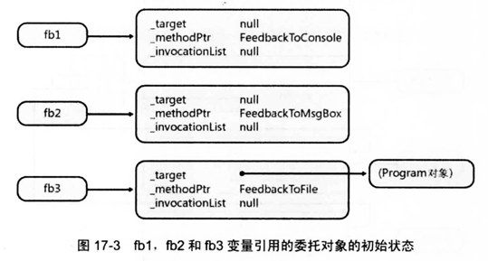
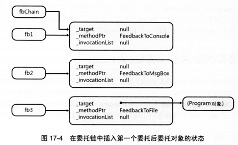
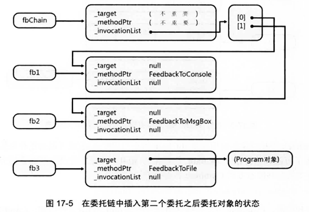
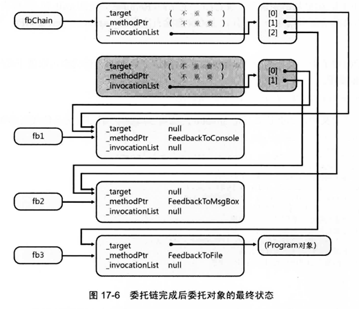

## 委托

> Microsoft .Net Framework 通过委托来提供回调函数机制。委托确保回调函数是类型安全的。还允许顺序调用多个方法，并支持调用静态方法和实例方法。

* 委托对象是方法的包装器_(warpper)_。

* 在一个类型中通过委托来调用另一个类型的私有成员，只要委托对象是由足够安全/可访问性的代码创建的，便没有问题。

* 将方法绑定到委托时，C#和CLR都允许引用类型的 `协变性` 和 `逆变性`。

  * 只有**引用类型**才支持，值类型和void都不支持。
  * **协变性_(covariance)_**
    * 方法能返回从委托的返回类型派生的一个类型。
  * **逆变性_(contravariance)_**
    * 方法获取的参数可以是委托的参数类型的基类。

  ```C#
  delegate Object MyCallback(FileStream stream);
  // 允许
  String Method(Stream stream);
  // 不允许
  Int32 Method(Stream stream);
  ```

#### 委托揭秘

* 所有委托类型都派生自 `System.MulticastDelegate` ，后者由派生自 `System.Delegate` ，最后是 `System.Object`。

  * 由于委托类型都派生自 `MulticastDelegate` ，所以继承了它的所有字段、属性和方法。其中有三个非公共字段尤为重要：

    |      字段       |     类型      | 说明                                                         |
    | :-------------: | :-----------: | :----------------------------------------------------------- |
    |     _target     | System.Object | 当委托对象包装一个静态方法时，这个字段为null，当委托对象包装一个实例方法时，这个字段引用的时回调方法要操作的对象。换言之，这个字段值指出要传给实例方法的饮食参数this的值。 |
    |   _methodPtr    | System.IntPtr | 一个内部的整数值，CLR用它标识要回调的方法。                  |
    | _invocationList | System.Object | 通常为null。构造委托链时它引用一个委托数组。                 |

  * 所有的委托都有一个构造器。他获取两个参数：一个对象引用，另一个时引用了回调方法的整数。

    

    

  * 执行回调方法 _fb.Invoke(val)_ 时，编译时是在定义委托类的时候定义`Invode()` 的，在 `Invoke()` 被调用时，它使用私有字段 __target_ 和 _methodPtr_ 在指定对象上调用包装好的回调方法。

    ```C# 
    internal delegate void Feedback(Int32 value);
    var fb = new Feedback(Program.FeedbackToConsole);
    fb(val) // 相等于 fb.Invoke(val);
    ```

#### 用委托回调多个方法(委托链)

> 委托链是委托对象的集合。可利用委托链调用集合中的委托所代表的全部方法。

> ```C#
> Feedback fb1 = new Feedback(FeedbackToConsole);
> Feedback fb1 = new Feedback(FeedbackToMsgBox);
> Feedback fb1 = new Feedback(Program.FeedbackToFile);
> 
> FeedbackfbChain = null;
> fbChain = (Feedback)Delegate.Combine(fbChain, fb1);
> fbChain = (Feedback)Delegate.Combine(fbChain, fb2);
> fbChain = (Feedback)Delegate.Combine(fbChain, fb3);
> ```

上述代码中，构造了三个委托对象并让指定的变量分别引用每个对象：



执行第一行 `Combine()` 代码时，方法发现合并的是 `null` 和 `fb1`，在内部，`Combine` 直接返回 `fb` 中的值，所以 `fbChain` 变量现在引用 `fb1` 变量所引用的委托对象：



再次调用 `Combine()` 时, `Combine()` 发现 `fbChain` 已引用了一个委托对象，所以 `Combine()` 会构造一个新的委托对象。新对象对它的私有字段 *_target* 和 *_methodPtr* 进行初始化，*_invocationList* 字段被初始化为引用一个委托对象数组。数组的第一个元素被初始化为引用包装了 `FeedbackToConsole` 方法的委托(也就是 `fbChain` 目前引用的委托)。数据的第二个元素被初始化为引用包装了 `FeedbackToMsgBox` 方法的委托。最后 `fbChain` 被设为引用新建的委托对象。



同样的，执行第三个方法后，`fbChain`  对象如图所示：



最后在 `fbChain` 引用的委托上调用 `Invoke` 时，该委托发现私有字段 *_invocationLIst* 不为 null,所以会执行一个循环来遍历数组中的所有元素，并依次调用每个委托包装的方法。

###### 从链中删除委托

```C#
fbChain = (Feedback)Delegate.Remove(fbChain, new Feedback(FeedbackToMsgBox));
```

* `Remove()` 每次只能从链中删除一个委托。
* `Remove()` 方法被调用时：
  * 扫描第一个实参(`fbChain`)所引用的那个委托对象内部维护的委托数组。
  * 查找其 *_target* 和 *_methodPtr* 字段与第二个实参中的字段匹配的委托。
  * 如果找到并且数组中只剩余一个数据项，就返回这个数据项。
  * 如果找到并且数组中还有多个数据项，就新建一个委托对象，并返回其引用。
  * 如果删除了仅有的一个元素，则返回

###### 委托链中返回数据

> 数组中的每个委托被调用时，其返回值被保存到一个变量中。循环完成后，该变量只包含最后一个委托的结果，该值返回给调用 `Invoke()` 的代码。

###### C#对委托链的支持

```C#
// +=
Delegate.Combine();
// -=
Delegate.Remove();
// 取得对委托链调用的控制
fbChain.GetInvocationList();
```


#### 泛型委托

* .Net Framework 提供了足够的 `Action<T>()` 和 `Fun<T>()`，需要定义委托的情况有：
  * 需要使用 `ref` 或 `out` 关键字以传引用的方式传递参数。
  * 需要通过 `params` 关键字获取数量可变的参数。
  * 需要为委托的任何参数指定默认值。
  * 需要对委托的泛型类型参数进行约束。
* 获取泛型实参并返回值的委托支持协变和逆变，建议多使用。