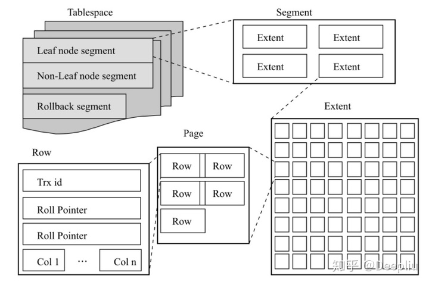

## InnoDB 逻辑存储结构

> 从InnoDB 引擎的逻辑存储结构看，所有数据都被逻辑得存放在一个空间中，被称为 `表空间(tablespace)`。
>
> `表空间` 又由 `段 (segment)`、`区 (extent)`、`页 (page)` _(有时也成为 `块(block)`)_ 组成。

* 如下图所示：

#### 表空间 _(tablespace)_

> `表空间` 可以看作是 InnoDB 存储引擎逻辑结构得最高层，所有的额数据都存放在表空间中。

* 开启独立表空间
  * 启用 `innodb_file_pre_table` _(创建的表大小默认是 96KB)_。
  * 每张表得独立表空间存放的是数据、索引和插入缓冲Bitmap页。
  * 其他类的数据：回滚_(undo)_、插入缓冲索引页、系统事务信息、二次写缓冲_(double write buffer)_ 等还是存放在原来的共享表空间_(ibdata1)_中。

#### 段 _(segment)_

> InnoDB 引擎中，对段的管理都是引擎自身所完成，DBA 不能也不必对其进行管理。

* 常见的段:
  * 数据段
    * B+Tree 的叶子节点。
  * 索引段
    * B+Tree 的非索引节点。
  * 回滚段等。

#### 区 _(extent)_

* 区 是由连续页组成的空间，在任何情况下每个区的大小都为 1M。

* 为了保证区中页的连续性，InnoDB 引擎一次从磁盘申请 4~5 个区。

* 默认情况下，InnoDB 引擎页的大小为 16KB，即一个区一共有 64 个连续的页。

> 在启用了 `innodb_file_pre_table` 后，创建的表默认大小是 96KB。
>
> 在每个段开始时，先用 32 个页大小的碎片页_(fragment page)_ 来存放数据，在使用完这些页之后才是 64个连续页的申请。
>
> 这么做的目的是：对于一些小表，或者是 undo 这类的段，可以在开始时申请较少的空间，节省磁盘容量的开销。

#### 页 _(page)_

> 页 是InnoDB引擎磁盘管理的最小单位。
>
> 默认每个页的大小为 16KB。

* 修改页的大小 _(InnoDB 1.2.x 开始)_：
  * 通过 `innodb_page_size` 将页的大小设置为 4K、8K、16K。
  * 设置完成，则所有表中页的大小都一样。不可以再次进行修改。除非通过 mysqldump 导入和导出操作来产生新的库。
* InnoDB引擎中，常见的页：
  * 数据页 _(B-tree Node)_
  * undo页 _(undo Log Page)_
  * 系统页 _(System Page)_
  * 事务数据页 _(Transaction System Page)_
  * 插入缓冲位图页 _(Insert Buffer Bitmap)_
  * 插入缓冲空闲列表页 _(Insert Buffer Free List)_
  * 未压缩的二进制大对象页 _(Uncompressed BLOB Page)_
  * 压缩的二进制大对象页 _(Compressed BLOB Page)_

#### 行

> InnoDB引擎是面向列_(row_oriented)_ 的，也就是是数据是按行进行存放的。
>
> 每个页最多允许存放 `16KB * 1024 / 2 - 200 = 7992` 行的记录。